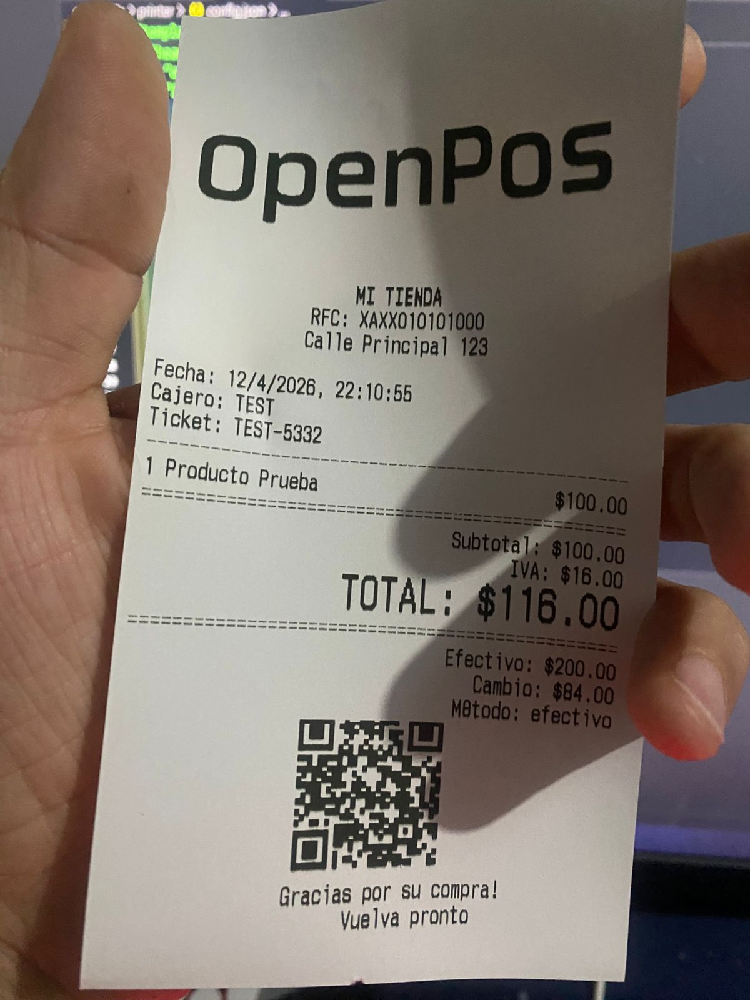
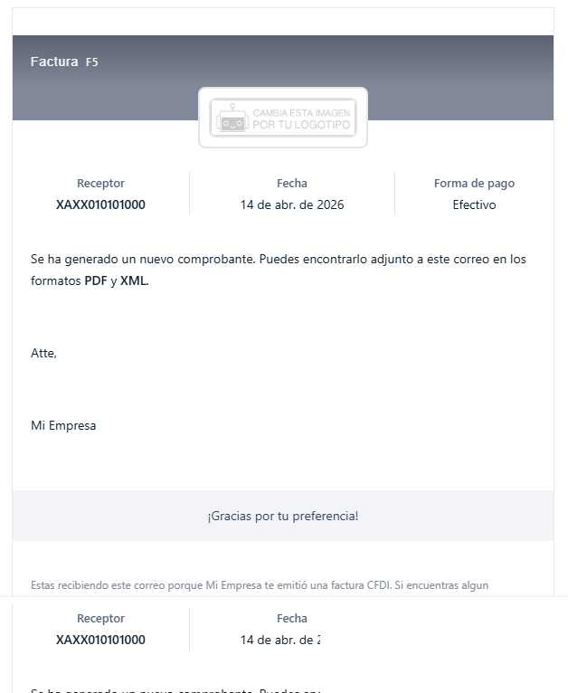
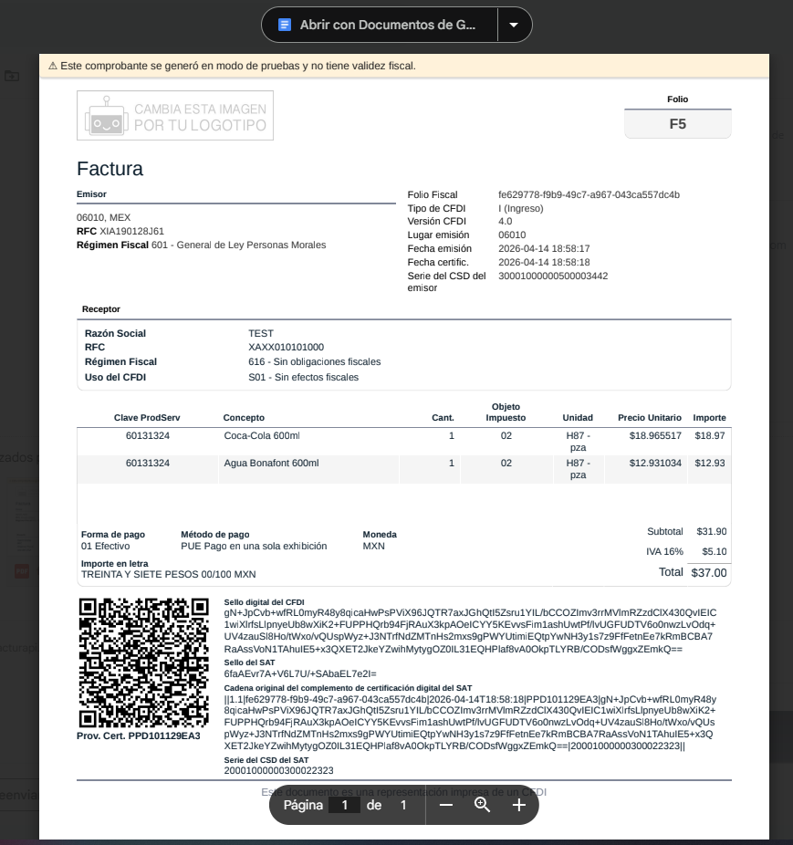
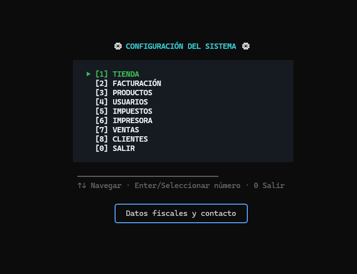

# OPENPOS

Sistema de punto de venta para terminal (TUI) construido con Bun, Ink, Zustand y Drizzle ORM.

## Screenshots

### Pantalla de Login


### Pantalla Principal


### Pantalla de Ticket


### Pantalla de Correo (factura)


### Pantalla (factura)


### Pantalla de Configuración


## Características

- **Gestión de ventas y tickets** - Venta rápida con código de barras
- **Inventario** - Productos con códigos de barras, categorías, unidades
- **Facturación CFDI** - Integración con FacturAPI para generar facturas
- **Sistema de clientes** - Registro de clientes con RFC para facturación
- **Puntos de fidelidad** - Sistema de puntos escalable para clientes
- **Impresión térmica** - Tickets con banner desde imagen
- **Reportes de ventas** - Reportes diarios y por período
- **Autenticación** - Login con PIN y roles (admin/cashier)
- **Configuración TUI** - Menú interactivo para todas las configuraciones

## Requisitos

- Bun (última versión)
- Node.js 22+
- Docker y Docker Compose (opcional)
- Impresora térmica (opcional)

## Instalación

```bash
# Instalar dependencias
npm install

# Inicializar base de datos
bun run seed
```

## Docker

Si prefieres usar Docker, el proyecto ya está configurado para ejecutarse en contenedores:

```bash
# Construir la imagen
docker-compose build

# Iniciar modo interactivo (Punto de Venta)
docker-compose up app
```

> [!IMPORTANT]
> Para interactuar con la interfaz TUI (terminal) dentro de Docker, es necesario que el servicio tenga `tty: true` y `stdin_open: true` (ya configurado en `docker-compose.yml`).

## Base de Datos

El sistema usa **SQLite** como motor de base de datos (archivo `pos.db`), gestionado con **Drizzle ORM**.

### Tablas

| Tabla | Descripción |
|-------|-------------|
| `products` | Catálogo de productos (sku, name, price, stock, etc.) |
| `sales` | Registro de ventas/tickets con datos de CFDI |
| `users` | Usuarios del sistema (username, pin, role) |
| `clients` | Clientes para facturación (RFC, razón social, puntos) |
| `config` | Configuración del negocio |

### Crear usuario

```bash
# Agregar usuario con rol cashier (por defecto)
pos.exe add user juan 1234

# Agregar usuario admin
pos.exe add user juan 1234 --role admin
```

### Roles disponibles

| Rol | Descripción |
|-----|-------------|
| `admin` | Acceso completo al sistema (configuración, usuarios, reportes) |
| `cashier` | Usuario de caja (solo ventas y reportes) |

## Uso

### Modo interactivo (Interfaz visual)

```bash
bun run dev
```

### Configuración (TUI)

```bash
pos --settings
```

Abre un menú interactivo para configurar:
- **Tienda** - Nombre, RFC, razón social, dirección, email, teléfono, régimen fiscal
- **Facturación** - API Key de FacturAPI, proveedor, modo sandbox
- **Productos** - Agregar, editar, eliminar, buscar, filtrar por categoría
- **Usuarios** - Agregar, editar, eliminar, cambiar rol
- **Impuestos** - Tasa de IVA (%), reiniciar número de ticket
- **Impresora** - Habilitar/deshabilitar impresión
- **Ventas** - Ver notas, filtrar por método de pago y status CFDI
- **Clientes** - Agregar, editar, eliminar, buscar, filtro por RFC/nombre/email/código

### Línea de comandos (CLI)

<<<<<<< HEAD
```bash
pos --help              # Mostrar ayuda
pos --version           # Mostrar versión
pos --settings          # Abrir configuración TUI
pos import products     # Importar productos desde CSV
pos export products     # Exportar productos a CSV
pos seed                # Insertar productos de ejemplo
pos add user <username> <pin> [--role]  # Agregar usuario
pos config get          # Ver configuración
pos config config set <key> <value>  # Actualizar configuración
```
=======
Puedes ejecutar los comandos directamente o a través de Docker:

| Comando | Ejecución Local | Ejecución Docker |
|---------|-----------------|------------------|
| Ayuda | `pos.exe --help` | `docker-compose run --rm app --help` |
| Versión | `pos.exe --version` | `docker-compose run --rm app --version` |
| Importar | `pos.exe import products` | `docker-compose run --rm app import products` |
| Exportar | `pos.exe export products` | `docker-compose run --rm app export products` |
| Seed | `pos.exe seed` | `docker-compose run --rm app seed` |
| Usuario | `pos.exe add user <user> <pin>` | `docker-compose run --rm app add user <user> <pin>` |
| Config Get | `pos.exe config get` | `docker-compose run --rm app config get` |
| Config Set | `pos.exe config set <k> <v>` | `docker-compose run --rm app config set <k> <v>` |
>>>>>>> 2ae9ae81a7c2b3405f737f12daecead51c952e57

### Importar Productos

#### Formato CSV

```csv
sku,name,price,cost,category,stock,barcode,unittype,unitqty,minstock
001,Producto 1,10.50,5.00,BEB,100,123456789,pza,1,10
002,Producto 2,25.00,12.00,ALI,50,987654321,kg,1,5
```

#### Campos CSV

| Campo | Requerido | Descripción |
|-------|-----------|-------------|
| sku | ✅ | Código único |
| name | ✅ | Nombre del producto |
| price | ✅ | Precio de venta |
| cost | ❌ | Costo |
| category | ❌ | Categoría (default: GEN) |
| stock | ❌ | Stock inicial (default: 0) |
| minStock | ❌ | Stock mínimo (default: 5) |
| unitType | ❌ | pza, kg, g, lt, ml, m, cm (default: pza) |
| unitQty | ❌ | Cantidad por unidad |
| barcode | ❌ | Código de barras |

#### Ejemplos de importación

```bash
# Importar productos
pos import products productos.csv

# Simular importación (sin guardar)
pos import products productos.csv --dry-run
```

## Facturación CFDI

El sistema soporta generación de facturas electrónicas mediante **FacturAPI**.

### Configuración

1. Obtener API Key de [FacturAPI](https://facturapi.io)
2. Ejecutar `pos --settings` e ir a **Facturación**
3. Ingresar API Key y configurar sandbox (pruebas) o producción
4. Guardar configuración

### Uso en ventas

1. Al pagar una venta, seleccionar opción de **facturar** (tecla F)
2. Ingresar RFC del cliente
3. Ingresar razón social
4. Ingresar email para enviar factura
5. El sistema crea/busca automáticamente el cliente y genera la factura

### Clientes para facturación

Los clientes se almacenan en la tabla `clients` con:
- **code** - Código interno único (CL-00001, CL-00002, etc.)
- **rfc** - RFC único del cliente
- **razonSocial** - Nombre o razón social
- **email** - Correo electrónico
- **telefono** - Teléfono de contacto
- **direccion** - Dirección fiscal
- **regimenFiscal** - Régimen fiscal (601, 603, etc.)
- **puntos** - Puntos de fidelidad (escalable para futuro)

### Sistema de puntos de fidelidad

Los clientes acumulan puntos que pueden usarse a futuro para:
- Descuentos en compras
- Canje por productos
- Niveles de cliente (bronze, silver, gold)

El sistema está diseñado para escalar con más campos en el futuro.

## Atajos de teclado

### Pantalla principal

| Tecla | Acción |
|-------|--------|
| Tab | Cambiar panel |
| ↑↓←→ | Navegar |
| Enter | Seleccionar/Pagar |
| 1-4 | Alternativas de navegación |
| / | Buscar productos |
| F | Facturar venta |
| R | Ver reportes |
| L | Cerrar sesión |
| Ctrl+Q | Salir |

### En panel Ticket (carrito)

| Tecla | Acción |
|-------|--------|
| + | Aumentar cantidad |
| - | Disminuir cantidad |
| d | Eliminar item |

### En configuración

| Tecla | Acción |
|-----|--------|
| 1-8 | Navegar secciones |
| ↑↓ | Mover en listas |
| Enter | Guardar/Confirmar |
| T | Impresión de prueba (en impresora) |
| E | Editar (en listas) |
| X | Eliminar (en listas) |
| A | Agregar (solo admin) |
| / | Buscar (en productos/clientes) |
| Esc | Volver atrás |

## Configuración de Impresora

El sistema de impresión utiliza los datos del negocio desde la base de datos y puede imprimir un banner desde `assets/banner.png`.

### Tipos de conexión

| Tipo | Interfaz | Descripción |
|------|----------|-------------|
| Windows Printer | `printer:NOMBRE` | Impresora local Windows |
| TCP | `tcp://192.168.1.100:9100` | Impresora de red |
| USB | `USB` | Impresora USB |
| Archivo | `/dev/usb/lp0` | Archivo/Dispositivo |

### Ancho de papel

| Ancho | Caracteres | Tipo |
|-------|------------|------|
| 48 | 48 caracteres | 80mm (default) |
| 58 | 58 caracteres | 58mm |
| 80 | 80 caracteres | 80mm |

### Charset

| Charset | Descripción |
|---------|-------------|
| PC437 | USA |
| PC850 | Multilingual |
| PC860 | Portuguese |
| PC863 | Canadian French |
| PC865 | Nordic |
| PC858 | Euro |
| WIN1252 | Windows Latin-1 |
| ISO8859_1 | ISO Latin-1 |

### Uso en Settings

1. Seleccionar **Tipo** de impresora con flechas →/←
2. Para **Windows Printer**, el campo **Interfaz** permite navegar ↑↓ para listar las impresoras del sistema
3. Presionar **T** para imprimir ticket de prueba
4. **Enter** para guardar configuración

## Construcción

```bash
# Compilar executable
bun build src/app.tsx --compile --outfile pos.exe
```

El ejecutable `pos.exe` queda en el directorio del proyecto. Los comandos CLI funcionan directamente con el ejecutable.

## GitHub

Repositorio: https://github.com/avalontm/openpos.git

## Licencia

Licencia MIT - Copyright (c) 2026 avalontm

Proyecto desarrollado por AvalonTM